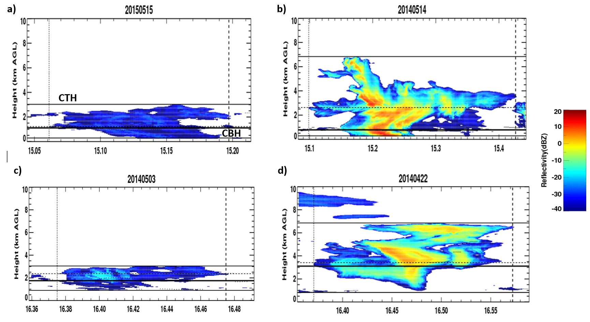

<!--***DAN: Search all files for ***DAN for comments-->

<!--***DAN: Proposal.Rmd knitted first time so that's good!-->

<!--***DAN The proposal: One major things that makes it hard to concretely evaluate is the lack of clearly stated questions or hypotheses. Or at least the lack of much along those lines. The only real question comes at the end of the intro: "Do entrainment rates (ER) vary across the two different convective cloud regimes?" Perhaps I am missing something but does this not just require getting the data ready and running a single one-way ANOVA (or analogous non-parametric test)? If that's all that is required, you probably wnt to add a bit to it. Also, it appears the historgram of CTH is not close to bimodal, so there is no sudden difference between the two categories. An ANOVA of EH betwee the categories miht be less statistically appropriate than a regression of EH against CTH, right?-->

<!--***DAN: Overall this is fine, but I think you are selling yourself a bit short by not going for something slightly more ambitious. I suggest amping it up slihtly for the final project. Nevertheless, this is enough to show effort on all parts of the assignment, so for this assignment you get: 10/10-->

```{r setup, include=FALSE}
knitr::opts_chunk$set(echo = TRUE)
```
# Entrainment in Shallow Cumulus and Congestus During GoAmazon 2014/5

## Introduction

Convective type clouds occur often near the equator. The Green Ocean Amazon 2014-2015 campaign included the deployment of several Atmospheric Radiation Measurement (ARM) instruments in Manacapuru, Brazil. This site was chosen due to its location close to the Intertropical Convergence Zone (ITCZ), making convective clouds and precipitation prevalent. The two types of convective clouds focused on in this study are shallow cumulus, with cloud top heights (CTH) between 0 and 4 km and cumulus congestus, with CTH between 4 and 9  km. The overarching goals of this project are to find the affects that precipitation has on the growth of each type of cloud and their entrainment (or lateral mixing of environmental air into the cloud) rates. Do entrainment rates (ER) vary across the two different convective cloud regimes? 


## Data and Methods

The Green Ocean Amazon 2014/2015 (GoAmazon) campaign included the deployment of DOE's Atmospheric Radiation Measurement (ARM) Mobile Facility at Manacapuru, Maunus, Brazil from January 2014 through December 2015. The W-band ARM Cloud Radar (WACR), a radar with high sensitivity to small cloud particles, took continuous data of the vertical profile of clouds as they advected over the site. Using the WACR reflectivities and Doppler velocities, cloud properties, including cloud base heights, CTH, and vertical velocities can be found.  This cloud information will be used to separate each cloud observed into the correct regime. A distribution of the differenct CTH found in the campaign can be seen in Figure 1. Each regime and their determinant properties are listed in Table 1 and examples of radar images of each are plotted in Figure 2. A total of 788 clouds were identified during the campaign. 
	
The entrainment rate is calculated, using observations, with a simple "entraining plume" model, which will use the CTH to estimate the entrainment rate for each of the clouds in the study. This entrainment rate will then be used to find possible correlations with relative humidity and cloud thickness. Plots and $R^2$ calculations will be shown to find possible correlations and compare the results of each regime. A student's t-test will also be done to see if the entrainment rate differences for each regime are significant. 


## Preliminary Results
Figure 1 shows the distribution of CTH in the campaign. It supports the definitions of shallow and congestus. The peak frequency of the CTH is near 4 km, so everything less than 4 km is chosen to be shallow to include the peak, and everything above is congestus. 

From the WACR reflectivity images, it appears that the majority of the clouds, both shallow and congestus are precipitating, since there is reflectivity observed near the surface. However, Table 1 shows the opposite. I think there is a problem with the way I am defining the CBH. I will need to redefine it so that the CBH is the lowest altitude where any reflectivity is observed, instead of a threshold of reflectivity. 


```{r data, echo=F}

source("Cloud_classification.R")
source("Precip_classification.R")

# Import data
data <- ImportData("cloud_data_all.csv")
CTHmax_s <- 4000.0
CTHmin_c <- 4000.0
CTHmax_c <- 9000.0
CBH_thresh <- 1000.0

# Classify clouds based on CTH
shallow_cloud <- Cloud_Classification(data, CTHmax_s, CTHmin_c, CTHmax_c)$shallow
congestus_cloud <- Cloud_Classification(data, CTHmax_s, CTHmin_c, CTHmax_c)$congestus

# Classify clouds based on CBH
shallow_precip <- Precip_Classification(shallow_cloud, CBH_thresh)$precip
shallow_noprecip <- Precip_Classification(shallow_cloud, CBH_thresh)$noprecip
congestus_precip <- Precip_Classification(congestus_cloud, CBH_thresh)$precip
congestus_noprecip <- Precip_Classification(congestus_cloud, CBH_thresh)$noprecip


```

```{r hist, echo=F, fig.cap="Figure 1: Histogram of the cloud top heights that occur during the campaign"}
hist(data$CTH/1000, xlab = "CTH (km)", main = "CTH Histogram")
```



```{r table, echo=F}

shal_p <- nrow(shallow_precip)
shal_np <- nrow(shallow_noprecip)
cong_p <- nrow(congestus_precip)
cong_np <- nrow(congestus_noprecip)


shal <- c(paste("shallow, precip - ", shal_p), paste("shallow, no precip - ", shal_np))
cong <- c(paste("congestus, precip - ", cong_p), paste("congestus, no precip - ", cong_np))

#shal <- c("shallow, precip", "shallow, no precip")
#cong <- c("congestus, precip", "congestus, no precip")

rows <- c("CBH < 100m", "CBH > 100m")

newTable <- data.frame(shal=shal,
                       cong=cong)

row.names(newTable) <- c("CBH < 100m", "CBH > 100m")

knitr::kable(newTable,
             col.names = c("CTH 0-4km", "CTH 5-9km"),
             row.names = TRUE,
             caption = "Table 1: Convective cloud regimes and how many of each occur during the campaign")


```

```{r boxplot, echo=F, fig.cap="Figure 3: Boxplot of the shallow and congestus entrainment rates"}
boxplot(list(shallow=shallow_cloud$ER, congestus=congestus_cloud$ER), 
       ylab=expression(paste("ER (% km"^-1,")"))
       )

```

```{r analysis, echo=F}
source("Analyze.R")

dataset <- list(shallow_precip, shallow_noprecip, congestus_precip, congestus_noprecip)

for(x in dataset){
  
Rsquare <- Analyze(x$ER, x$RH)

}


```


```{r ttest, echo=F}
source("T_test.R")

ttest <- T_test(shallow_cloud$ER, congestus_cloud$ER)
mean_shal <- mean(shallow_cloud$ER)
mean_cong <- mean(congestus_cloud$ER)

```

The initial boxplots show that there could be a difference in ER for different regimes (Figure 3). The mean ER is lower for congestus (`r round(mean_cong,1)`% km^-1^) than shallow (`r round(mean_shal,1)`% km^-1^), which makes sense. Lower mixing values are needed to allow the cloud to grow taller. This difference is also significant. The null hypothesis that the two means are equal can be rejected at the 95% confidence interval, since the p-value of the t-test is `r round(ttest,3)`.

More quantitative analysis needs to be done, including the Student's T test for the precipitation regimes to determine if ER varies between other regimes, using "T_test.R". The variables explaining ER also need to be looked at, including the RH and cloud thickness, which will use "Analyze.R". Plots will be made to show the qualitative analysis of the correlations and regime differences.
